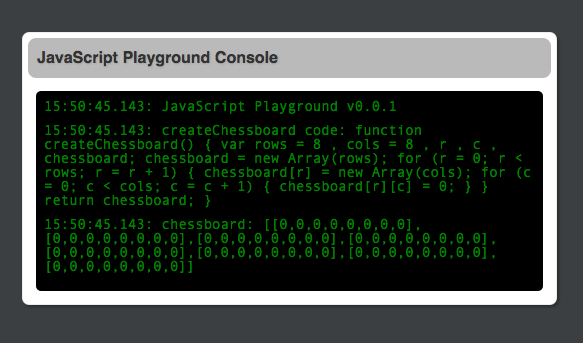

# JavaScript PlayGround (JSPG)
A simulated console for playing with JavaScript

This project is a some what silly way of playing around with JavaScript.  The basic premise is that this is a container project where you can write small Javascript snipets and see the results using the underlying liveedit feature.  The results of your Javascript snipet is shown in a mock console hosted in a web page.




To add your own JS code just edit the `js/playground.js` file.

    window.playground = function() {
      'use strict';
      consoleLog('Welcome to the playgound');
    };

Output to the mock console using the global `consoleLog` function.

Side note: this project is based on the [Modern Website Seed (MWS)](https://github.com/cjus/modern-web-seed)

You can start the app using gulp.

    $ gulp

    [09:21:21] Using gulpfile ~/dev/cjus/jsplayground/gulpfile.js
    [09:21:21] Starting 'watch'...
    [09:21:21] Finished 'watch' after 8.92 ms
    [09:21:21] Starting 'connect'...
    [09:21:21] Finished 'connect' after 7.18 ms
    [09:21:21] Starting 'default'...
    [09:21:21] Finished 'default' after 5.72 μs
    [09:21:21] Server started http://localhost:8080
    [09:21:21] LiveReload started on port 35729

Then simply point your web browser to: http://localhost:8080  and continue editing your code. Saving your code will trigger a browser refresh.

## Setup

First I assume you've installed Git and NodeJS

* Download and install [git](http://git-scm.com/downloads)
* Download and install [nodeJS](http://nodejs.org/download/)

Check the version of NPM you have installed:

    $ npm --version

If the version is less than 2.0.0, upgrade using:

    $ npm install -g npm

JSPG requires that you have [bower](http://bower.io/), [gulp](http://gulpjs.com) and [karma](http://karma-runner.github.io) installed:

```shell
$ sudo npm install -g bower 
$ sudo npm install -g gulp
$ sudo npm install -g karma-cli
```
     
In the project folder we need to hydrate the project's required files.

```shell
$ sudo npm install
$ bower install
```

Note: this install can take a several minutes to complete.

